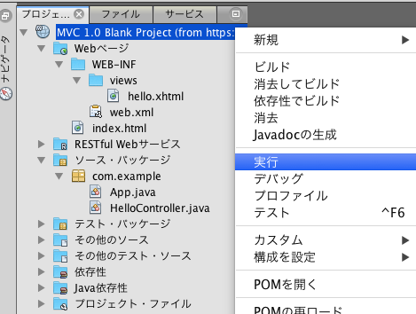
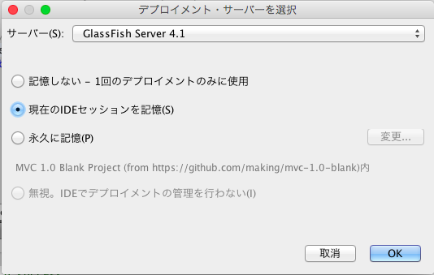
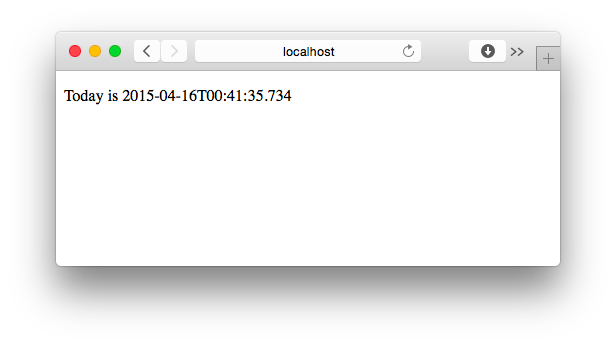

# MVC 1.0 Blank

Maven archetype to create a maven project for MVC 1.0 (JSR-371)

## How to use

with Bash

    mvn archetype:generate\
     -DarchetypeGroupId=am.ik.archetype\
     -DarchetypeArtifactId=mvc-1.0-blank-archetype\
     -DarchetypeVersion=1.0.0-m01

with CommandPrompt (Windows)

    mvn archetype:generate^
     -DarchetypeGroupId=am.ik.archetype^
     -DarchetypeArtifactId=mvc-1.0-blank-archetype^
     -DarchetypeVersion=1.0.0-m01

### Example

#### Create a project

```
$ mvn archetype:generate -B\
 -DarchetypeGroupId=am.ik.archetype\
 -DarchetypeArtifactId=mvc-1.0-blank-archetype\
 -DarchetypeVersion=1.0.0-m01\
 -DgroupId=com.example\
 -DartifactId=mvc-demo\
 -Dversion=1.0.0-SNAPSHOT
```
Open the project with NetBeans and run the application



Choose GlassFish 4.1



Access [http://localhost:8080/mvc-demo/app/hello](http://localhost:8080/mvc-demo/app/hello) (Context root is your artifactId).




## License

Licensed under the Apache License, Version 2.0.
